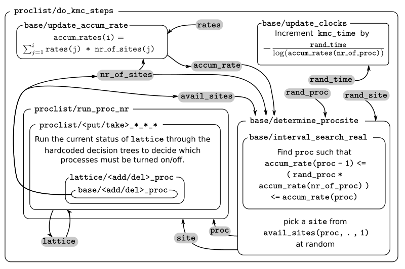
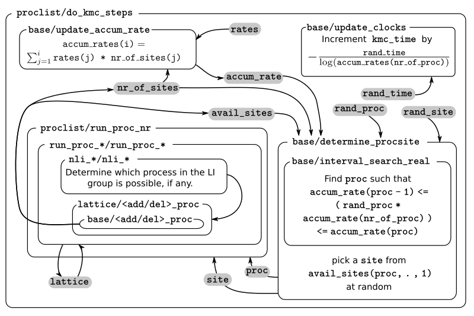
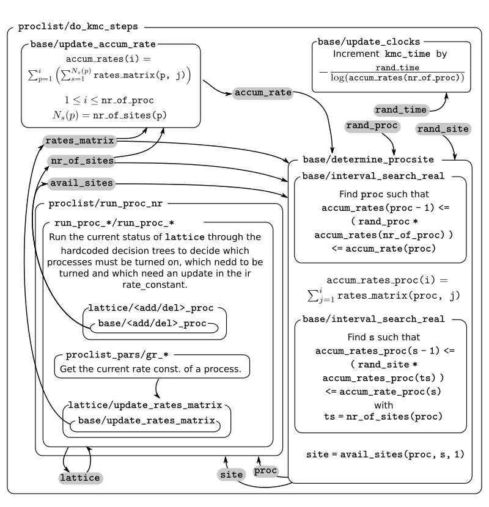

Developer's guide
=================

Introduction and disclaimer
---------------------------

This guide intends to work as an introduction into kmos' internal
structure, including both the automatically generated Fortran code, as
well as the code generation procedure. As the name suggest, the intended
audience are those who want to contribute to kmos as developers. This
guide will assume that you are familiar with the way in which kmos is
used. If that is not the case, you should start reading the sections of
the `documentation <http://kmos.readthedocs.io>`__ intended for users
and/or go through the `Intro to
kmos <http://github.com/jmlorenzi/intro2kmos>`__ tutorial.

**DISCLAIMER**: This is information is provided with the hopes that it
will ease your way into kmos' codebase, but it may contain errors. In
the end only the interpretation of the code itself can really let you
effectively add functionality to kmos.

Some nomenclature.
------------------

For some terms used frequently in this guide, there might exist some
ambiguity on exact meaning. Here we present some definitions to try to
alleviate this. Probably some ambiguity will remain, but hopefully not
anything that cannot be discerned from context.

**site**: In kmos, this can have two different interpretations: either a
specific node of the lattice or a type of site, e.g. a crystallographic
site (top, fcc, hollow…). In this guide we use the former meaning: an
specific position on the simulation lattice. When we need to indicate
the second meaning, we will use **site type**.

**coordinate**: indicates the relative position of a site in the lattice
with respect to some other site. In general, a coordinate will be given
as a pair of site pair and an offset representing the relative positions
of the unit cells (in units of the unit cell vector). The site used as
reference will depend on the context.

**process**: a set of elementary changes that can occur on the lattice
state on a single kMC step. A process is defined by a list of conditions
and actions, and a rate constant expression.

**executing coordinate**: A coordinate associated to each process to be
used as a reference for the relative positions of conditions and actions
when defining the Fortran routines. In ``local_smart`` and ``lat_int``
the executing coordinate is found with the help of the
``kmos.types.Process.executing_coord`` method. In ``otf`` the concept of
executing coordinate is not used, the reference position in the lattice
is the central position implied by the user during model definition,
i.e. the position in which coordinates have ``offset = (0, 0, 0)``.

**event**: a process for which an specific site has been selected.

**active event**: An event that can be executed given the current state
of the lattice, i.e. an event for which all associated conditions are
fulfilled.

**lateral interactions**: For kmos models built for the ``local_smart``
or ``lat_int``, we will say that such model includes *lateral
interactions* if there is one or more groups of processes with the
following characteristics:

a. their actions are all identical
b. the conditions occurring on the same sites as the actions are identical
c. there is a group of additional sites in which these processes have conditions, but these conditions are different for each process in the group

These processes represent the same change in the lattice, but under a
difference state of the rest of the sites. These groups of processes are
typically used to account for the effect of surrounding species on the
values of the rate constants, i.e. the lateral interactions.

**lateral interaction group**: The group of processes defined by items
a, b, c above.

**bystander** (``local_smart`` or ``lat_int`` backends) The set of
conditions of item c above, i.e. conditions of a process in a lateral
interaction groups that do not have an action associated to it.

**bystander site/coordinate**: A site/coordinate associated with a
bystanders.

**participating sites**: Sites associated with actions from item a and
conditions from item b of the definition of a lateral interaction group.

**lateral interaction event group**: a collection of events occurring on
the same lattice site and whose associated processes belong to the same
lateral interaction group. Due to the nature of lateral interaction
groups, only one of such events can be possible in a lattice at any
given time.

**bystander** (``otf`` backend): In the ``otf`` backend, the concept of
bystander is explicitly included in the model definition, i.e. it is a
new class ``kmos.types.Bystander`` exclusive to this backend. An ``otf``
model is said to include lateral interactions if one of its processes
includes such bystanders. Note that models *without* lateral
interactions should not be built using the ``otf`` backend, as
``local_smart`` will definitely be more efficient.

The three *backends*
--------------------

While most kmos users will only need to worry about the Python interface
to build and run the model, developers will also need to familiarize
with the FORTRAN core code. The exact structure of this code depends on
the *backend* that one selects. Which backend is most appropriate
depends on the nature of the kMC model being implemented. Below we
present a qualitative description of each backend.

``local_smart``
~~~~~~~~~~~~~~~

This is the original kmos backend and has been used as a basis and
inspiration for the rest of the backends. It was built with the implicit
objective of offering the best run time performance at the expense of
memory usage. For this reason, a key element in this backend is a
precalculated list of rate constants, stored in the ``base/rates``
array.

This is the most efficient backend when the number of different rate
constants list is reasonable small.

For models with very large number of different processes ``nproc`` (such
as cases in which large lateral interaction groups exist) some
undesirable effects can occur:

-  The time needed to run a kMC step can become large, as it scales as
   :math:`\mathcal{O}(\texttt{nproc})`.
-  The bookkeeping data structures, which scale in size with the total
   number of processes, can become too big for available memory.
-  The size of individual source code files can become very large,
   making compilation very slow or even impossible due to memory
   requirements.

``lat_int``
~~~~~~~~~~~

The ``lat_int`` backend is the first attempt to alleviate the problems
of ``local_smart`` for models with lateral interaction groups of
moderate size. The main differences between them is that ``lat_int``
structures the generated code around the different lateral interaction
groups and splits the source files accordingly. This way compilation is
faster and requires less memory. A necessary consequence of this is that
the logic for the lattice update needs to be different.

TODO: I seem to recall that there are models for which ``lat_int``
outperforms ``local_smart``, even when ``local_smart`` can eventually
compile and run. This should be verified and interpreted (i.e. is
``lat_int`` smarter than ``local_smart`` some times? If so, why?).

``otf``
~~~~~~~

For processes with lots of lateral interactions, i.e. very large lateral
interaction groups, keeping a list of precalculated rate constants (and
the proportionally large bookkeeping arrays) is unfeasible. The
alternative is to evaluate rate constants during runtime, i.e. *on the
fly*. kMC models built using the ``otf`` array do just that. To
accommodate for this, the concept of a process in ``otf`` is different
to that in the other backends. In ``otf``, all members of a lateral
interaction group are represented by a single process. Therefore, the
total number of processes and, consequently, the size of bookkeeping
arrays is much smaller. The counterpart from this improvement is that
now a kMC step scales linearly with the system size (instead of being
constant time).

The structure of the FORTRAN code.
----------------------------------

Here we present a description of the different files in which the source
code is split. We use the ``local_smart`` backend as a basis for this
description, as it is the basis for the others and the one that contains
the fewest different files. For the other backends, we will only explain
the differences with ``local_smart``.

All kmos models contain train main source files: ``base.f90``,
``lattice.f90`` and ``proclist.f90``. Each of these source files defines
a module of the same name. These modules are exposed to Python
interface.

Files for the ``local_smart`` backend
~~~~~~~~~~~~~~~~~~~~~~~~~~~~~~~~~~~~~

``base.f90``
^^^^^^^^^^^^

As it name suggests, ``base.f90`` contains the lowest-level elements of the model. It implements the kMC method in a 1D lattice. The ``base`` module contains all the bookkeeping arrays described in :ref:`Key data-structures <data-structs>` and the routines used to

-  allocate and deallocate memory
-  update of the bookkeeping arrays for lattice configuration and
   available processes
-  using such arrays to determine the next process to be executed
-  keep track of kMC time and total number of steps
-  keep track of the number of executions of each individual process
   (``procstat``)
-  saving an reloading the system's state

Many routines in base take a variable ``site`` as input. This is an
index (integer value) that identifies a site on the 1D representation of
the lattice (i.e. the ND lattice of the problem, flattened).

The contents of ``base.f90`` are (mostly) fixed, i.e. it is (almost) the
same file for all kmos models (as long as they use the same backend).

.. _lattice:

``lattice.f90``
^^^^^^^^^^^^^^^

The role of the ``lattice.f90`` is to generate the map from the ND
lattice (N=1, 2, 3) to the 1D lattice that is handled by ``base.f90``.
The ``lattice`` module imports subroutines from the ``base`` module.
Beside the look-up arrays ``lattice2nr`` and ``nr2lattice``, used to map
to and from the 1D lattice, this module also implements wrappers to many
of the basic functions defined in ``base.f90``. Such wrappers take now a
4D array ``lsite`` variable, designating the site on a 3D lattice,
instead of the single integer ``site`` used by ``base``. The first three
elements of this array indicate the ( (x, y, z) ) position of the
corresponding unit cell (in unit cell vector units), while the fourth
indicates the site type. In cases of lower dimensional lattices, some
elements of the ``site`` array simply stay always at a value of 0.

The ``lattice.f90`` file needs to be generated especially for each
model, but only changes if the lattice used changes (e.g. if the number
of site types or the dimension of the model).

``proclist.f90``
^^^^^^^^^^^^^^^^

``proclist.f90`` includes the routines called by the Python interface
while running the model. In addition, it encodes the logic necessary to
update the list of active events (i.e. the main bookkeeping arrays,
``avail_procs`` and ``nr_of_sites``), given that a specific process has
been selected for execution. The module imports methods and variables
from both the ``base`` and ``lattice`` modules.

The ``proclist.f90`` files needs to be generated specially for each
model, and is the file that changes most often during model development,
as it is updated every time a process changes.

Files for the ``lat_int`` backend
~~~~~~~~~~~~~~~~~~~~~~~~~~~~~~~~~

``proclist.f90``
^^^^^^^^^^^^^^^^

Some of the functionality that existed here in ``local_smart`` has been
moved to different source files. While the functions called by the
Python interface during execution remain here, the logic to update the
list of active events is moved to ``nli_*.f90`` and ``run_proc_*.f90``
files. In addition, constants are also defined in an independent module
on the separate file ``proclist_constants.f90``.

``proclist_constants.f90``
^^^^^^^^^^^^^^^^^^^^^^^^^^

Defines a module declaring several constants used by ``proclist``,
``nli_*`` and ``run_proc_*`` modules.

``nli_<lat_int_nr>.f90``
^^^^^^^^^^^^^^^^^^^^^^^^

There is one of such file for each lateral interaction group. These
source files are enumerated starting from zero. Each of them implements
a module called ``nli_<lat_int_nr>`` which contains a single function
``nli_<lat_int_group>``. ``<lat_int_group>`` is the name of the lateral
interaction group, which coincides with the name of the first (lowest
index) process in the group. These functions implement logic to decide
which process from the group can occur on a given site, if any.

``run_proc_<lat_int_nr>.f90``
^^^^^^^^^^^^^^^^^^^^^^^^^^^^^

There is one of such file for each lateral interaction group. These
source files are enumerated starting from zero. Each of them implements
a module called ``run_proc_<lat_int_nr>`` that contains a single
subroutine ``run_proc_<lat_int_group>``. ``<lat_int_group>`` is the name
of the lateral interaction group, which coincides with the name of the
first (lowest index) process in the group. This routine is responsible
of calling ``lattice/add_proc`` and ``lattice/del_proc`` for each
lateral interaction group that should potentially be added or deleted.
For this, it passes results of the ``nli_<lat_int_group>`` functions as
argument, to ensure correct update of the list of active events.

Files for the ``otf`` backend
~~~~~~~~~~~~~~~~~~~~~~~~~~~~~

``proclist.f90``
^^^^^^^^^^^^^^^^

Similar to ``lat_int``, this file contains the functions called by the
Python interface at runtime. Contrary to ``local_smart``, the logic for
the update of the active event list is in the ``run_proc_<proc_nr>.f90``
files and constants shared among different modules are defined on
``proclist_constants.f90``.

``proclist_constants.f90``
^^^^^^^^^^^^^^^^^^^^^^^^^^

Defines constant values to be shared between the ``proclist``,
``proclist_pars`` and ``run_proc_*``.

``proclist_pars.f90``
^^^^^^^^^^^^^^^^^^^^^

This file implements the modules ``proclist_pars`` ("process list
parameters") and takes care of providing functionality that that only
existed at the Python level in the earlier backends. More importantly,
it implements the functions used to evaluate rate constants during
execution. In more detail it:

-  Implements the Fortran array ``userpar`` to access user-defined
   parameters at FORTRAN level, and functionality to update them from
   Python.
-  When necessary, it implements a ``chempots`` array for accessing the
   chemical potentials in FORTRAN.
-  It includes the routines ``gr_<proc_name>`` and ``rate_<proc_name>``,
   which are used to evaluate the rate constants on the fly.

``run_proc_<proc_nr>.f90``
^^^^^^^^^^^^^^^^^^^^^^^^^^

There is one of such file for each process in the model. They implement
modules ``run_proc_<proc_nr>`` containing a ``run_proc_<proc_name>``
subroutine each. These routines contain the decision trees that figure
out which events need to be activated or deactivated and call the
corresponding functions from ``base`` (``add_proc`` and ``del_proc``).

.. _data-structs:

Key data-structures
-------------------

Here we describe the most important arrays required for bookkeeping in
kmos. Understanding what information these arrays contain is crucial to
understand how kmos selects the next kMC process to be executed. This is
explained in :ref:`One kmc step in kmos <kmc-step>`. All these data
structures are declared in the ``base`` module and their dimensions are
based on the "flattened" representation of the lattice in 1 dimension.

Important scalar variables
~~~~~~~~~~~~~~~~~~~~~~~~~~

-  ``nr_of_proc`` (int): The total number of processes in the model
-  ``volume`` (int): The total number of sites in the lattice

Important arrays
~~~~~~~~~~~~~~~~

``rates``
^^^^^^^^^

-  Dimension: 1
-  Type: float
-  Size: ``nr_of_proc``

Contains the rate constants for each process. This array is kept fixed
during the execution of the kMC algorithm, and is only to be changed
through the Python interface.

In the ``otf`` backend, rate constants are obtained on-the-fly during
the execution of the kMC algorithm and stored in the ``rates_matrix`` array and the ``rates`` arrays
contains simply a set of "default" rate constant values. These values
can optionally (but not necessarily) be used to help with the
calculation of the rates.

``lattice``
^^^^^^^^^^^

-  Dimension: 1
-  Type: int
-  Size : ``volume``

This array contains the state of the lattice, i.e. which species sits on
each site.

``nr_of_sites``
^^^^^^^^^^^^^^^

-  Dimensions: 1
-  Type: int
-  Size: ``nr_of_proc``

This array keeps track of the number of currently active events
associated to each process, i.e. it holds the number of different sites
in which a given process can be executed.

``accum_rates``
^^^^^^^^^^^^^^^

-  Dimensions: 1
-  Type: float
-  Size: ``nr_of_proc``

This array is used to store partial sums of rate constants, ordered
according to process index. In ``local_smart`` and ``lat_int``, thanks
to the fact that all copies of a process have an equal rate constant,
the values of this array can be calculated according to

.. math:: \text{\texttt{accum\_rates(i)}} = \sum_{j=1}^{\text{\texttt{i}}} \text{\texttt{rates(j)}} \, * \, \text{\texttt{nr\_of\_sites(j)}}
   :label: accum-rates-summation

In ``otf`` rate constants for a given process are different for a given
site. Therefore, evaluation is more involved, namely

.. math::


   \text{\texttt{accum\_rates(i)}} = \sum_{j=1}^{\text{\texttt{i}}} \sum_{k=1}^{
   \texttt{nr\_of\_sites(j)}}   \text{\texttt{rates\_matrix(j, k)}}

In all backends, the contents of ``accum_rates`` are reevaluated every
kMC step.

``avail_sites``
^^^^^^^^^^^^^^^

-  Dimensions: 3
-  Type: int
-  Size: ``nr_of_proc * volume * 2``

This is arguably the most important bookkeeping array for kmos, which
keeps track of which processes can be executed each sites on the
lattice, i.e. keeps track of all active events. To accelerate the update
time of these arrays (see `here <#sec:updating-avail-sites>`__), the
information this array contains is duplicated. In practice,
``avail_sites`` can be considered as two 2D arrays of size
``nr_of_proc * volume``.

Each row in ``avail_sites(:, :, 1)`` correspond to a process, and
contains a list of the indices for the sites in which said process can
occur according to the current state of the lattice, i.e. a list of the
sites with active events associated to this process. Each site index
appears at most once on each row. This array is filled from the right.
This means that the first ``nr_of_sites(i)`` elements of row ``i`` will
be larger than zero and smaller or equal than ``volume``, while the last
``( volume - nr_of_sites(i) )`` elements will all be equal to zero. The
elements of the rows of ``avail_sites( :, :, 1)`` are **not** sorted,
and their order depends on the (stochastic) trajectory the system has
taken.

The rows on ``avail_sites( :, :, 2)`` function as an index for the rows
of ``avail_sites( :, :, 1)``. Given ``1 <= i <= nr_of_proc`` and
``1 <= j <= volume``, if process ``i`` can occur on site ``j``, then
``avail_sites(i, j, 2) = k``, with ``k >= 1`` and such that
``avail_sites(i, k, 1) = j``. Conversely, if process ``i`` cannot occur
on site ``j``, then ``avail_sites(i, j, 2) = 0`` and no element in
``avail_sites(i, :, 1)`` will be equal to ``j``.


   A example of an `avail_sites` array for a model with 5 processes and 10 sites.

``procstat``
^^^^^^^^^^^^

-  Dimensions: 1
-  Type: long int
-  Size Total number of processes (``nr_of_proc``)

This array is used to keep track of how many times each process is
executed, i.e. the fundamental result of the kMC simulation. This array
is used by the Python interface to evaluate the turnover frequencies
(TOFs).

Additional arrays for the ``otf`` backend
~~~~~~~~~~~~~~~~~~~~~~~~~~~~~~~~~~~~~~~~~

The ``otf`` backend uses all the bookkeeping arrays from the other two
backends, but needs in addition the following

``accum_rates_proc``
^^^^^^^^^^^^^^^^^^^^

-  Dimension: 1
-  Type: float
-  Size: ``volume``

This array is updated in every kMC step with the accumulated rate for
the process selected for execution. This is necessary because the site
cannot be selected uniformly random from ``avail_sites``, but needs to
be picked with a binary search on this array.

``rates_matrix``
^^^^^^^^^^^^^^^^

-  Dimension: 2
-  Type: float
-  Size: ``nr_of_proc * volume``

This matrix stores the rate for each current active event. The entries
of this matrix are sorted in the same order as the elements of
``avail_sites(:, :, 1)`` and used to update the ``accum_rates`` array.

.. _kmc-step:

One kmc step in kmos
--------------------



   A kMC step using kmos' ``local_smart`` backend. Subroutines are represented by labeled boxes. The content of a given box summarizes the operations performed by the subroutine or the subroutines called by it. Variables (scalar or arrays) are indicated by gray boxes. An arrow pointing to a variable indicates that a subroutine updates it (or defines it). Arrows pointing to a subroutine indicate that the routine uses the variable. In kmos, the passing of information occurs both through subroutine arguments and through module-wide shared variables; this distinction is not present in the diagram.

The main role of the bookkeeping arrays from last section, specially
``avail_sites`` and ``nr_of_sites``, is to make kMC steps execute fast
and without the need to query the full lattice state. The routines
``do_kmc_step`` and ``do_kmc_steps`` from the ``proclist`` module
execute such steps. The diagram above represents the functions called by these
routines.

During system initialization, the current state of the system is written
into the ``lattice`` array and the ``avail_sites`` and ``nr_of_sites``
arrays are initialized according to this. With these arrays in sync, it
is possible to evaluate ``accum_rates`` according to eq. :eq:`accum-rates-summation`. With this information, and using two random
numbers :math:`0 < \texttt{ran\_proc}, \texttt{ran\_site} < 1`, the
routine ``base/determine_procsite`` can select the next event to
execute. This subroutine first selects a process according to the
probabilities given by ``accum_rates``. This is achieved by multiplying
the total accumulated rate, i.e. the last element of ``accum_rates``,
times ``ran_proc``. The subroutine ``base/interval_search_real``
implements a `binary
search <http://en.wikipedia.org/wiki/Binary_search_algorithm>`__ to find
the index ``proc`` such that

.. math::
   
   \texttt{accum\_rates(proc -1)} \le \\
   \texttt{ran\_proc \* accum\_rates(nr\_of\_proc)} \le \\
   \texttt{accum\_rates(proc)}.

This step scales O(\ :math:`\log` (``nr_of_proc``)). Then, a site is
selected with uniform probability from the (non-zero) items of
``avail_sites(proc,:,1)``. This is valid because all individual events
associated to a given processes share the same rate constant. This way,
we avoid searching through the whole lattice, and we are able to select
a ``site`` at constant time.

After this, the ``proclist/run_proc_nr`` subroutine is called with
``proc`` and ``site`` as arguments. This function first calls
``base/increment_procstat`` with ``proc`` as argument to keep track of
the times each process is executed. Next, it uses the ``nr2lattice``
look-up table to transform the *scalar* ``site`` variable into the 4D
representation (see :ref:`lattice.f90 <lattice>`). Finally, this
functions calls the methods which actually update the the lattice state
and, consistent with this, the bookkeeping arrays. These are the
``proclist/take_<species>_<layer>_<site>`` and
``proclist/put_<species>_<layer>_<site>`` methods. Given a lattice site,
``take`` methods replace the corresponding species sitting there with
the default species. The put methods do the converse. The set of put and
take routines that need to be executed by each process are directly
obtained from the conditions and actions from the process definition.
These are hard-coded into the ``proclist/run_proc_nr`` routine,
organized in a case-select block for the ``proc`` variable.

The ``proclist/take_<species>_<layer>_<site>`` and
``proclist/put_<species>_<layer>_<site>`` subroutines are arguably the
most complex of a ``local_smart`` kmos model. Their ultimate goal is to
call ``lattice/add_proc`` and/or ``lattice/del_proc`` to update
``avail_sites`` and ``nr_of_sites`` in correspondence with the change in
the lattice they are effecting. To do this they need to query the
current state of the lattice. The structure of these routines is
described :ref:`below <put-take>`.

The actual update of ``avail_sites`` and ``nr_of_proc`` is done by the
``base/add_proc`` and ``base/del_proc`` functions. Under :ref:`Updating avail_sites <updating-avail-sites>` below, we explain how
these functions make use of the structure of ``avail_sites`` to make
updates take constant. Once these arrays have been updated, the
bookkeeping arrays are again in sync with the lattice state. Therefore,
it is possible to reevaluate ``accum_rates`` using eq.  :eq:`accum-rates-summation` and start the process for the selection of the next step.

.. _put-take:

The ``put`` and ``take`` routines
~~~~~~~~~~~~~~~~~~~~~~~~~~~~~~~~~

These subroutines take care of updating the lattice and keeping the
bookkeeping arrays in sync with it. When the occupation of a given site
changes, some formerly active events need to be deactivated, while some
formerly inactive events need to be activated. Figuring out which those
events are is the main role of the ``put`` and ``take`` routines.

In kmos, processes are represented by a list of conditions and a list of
actions. An event is active if and only if all the conditions of its
associated process are satisfied. As the put and take routines only look
at the change of an individual site in the lattice, determining which
events need to be turned-off is straightforward: All active events which
have a condition that gets unfulfilled on the site affected by the
put/take routine will be deactivated. This is the first thing put/take
routines do after updating the lattice.

Deciding which processes need to be activated is more involved. All
inactive events with a condition that gets fulfilled by the effect of
the put/take routine are candidates for activation. However, in this
case, it is necessary to check the lattice state to find out whether or
not such events have all other conditions fulfilled. A straightforward
of accomplishing this is to sequentially look at each event, i.e.:

::
   
   FOR each candidate event E
       TurnOn = True
       FOR each condition C of E
       IF C is unfulfilled:
           TurnOn = False
           break
       ENDIF
       ENDFOR
       IF TurnOn is True:
       Activate E
       ENDIF
   ENDFOR

However, chances are that many of the candidate events will have
conditions on the same site. Therefore, a routine like the above would
query a given lattice site many times for each execution of a put/take
routine. For complex models with many conditions in the processes, this
could become quickly the main computational bottleneck of the
simulation.

The alternative to this naive approach, is to try to build a decision
tree that queries the lattice state more efficiently. kmos generates
such a decision tree using an heuristic algorithm. The main idea behind
it is to group all the sites that would need to be queried and to sort
them by the number of candidate events with conditions on them. A
decision tree is built such that sites are queried on that order, thus
prioritizing the sites that are more likely to reduce the number of
processes that need activation. Such decision trees are implemented as
select-case trees in the put/take routines and typically occupy the bulk
of the code of ``proclist.f90``. A more detailed description on how this
is done is discussed :ref:`below <write-put-take>`.

.. _updating-avail-sites

Updating ``avail_sites``
~~~~~~~~~~~~~~~~~~~~~~~~


   Adding an process to the =avail_sites= array. Pseudocode for the addition of a process is also indicated.

The ``avail_sites`` and ``nr_of_sites`` arrays are only updated through
the ``base/add_proc`` and ``base/del_proc`` subroutines, which take a
process index ``proc`` and a site index ``site`` as input arguments.
Adding events is programmatically easier. As the rows of
``avail_sites( :, :, 1)`` are filled from the left, the new event can be
added by changing the first zero item of the corresponding row, i.e.
``avail_sites(proc, nr_of_sites(proc) + 1, 1)``, to ``site`` and
updating ``avail_sites( :, :, 2)`` and ``nr_of_procs`` accordingly. An
example of this procedure is presented in the figure above.


   Deleting an process from =avail_sites= array. Pseudocode for the deletion of a process is also indicated.


Deleting an event is slightly more involved, as non-zero elements in
``avail_sites(:, :, 1)`` rows need to remain contiguous and on the left
side of the array. To ensure this, the element that would be deleted
(somewhere in the middle of the array) is updated to the value of the
last non-zero element of the row, which is later deleted. To keep the
arrays in sync, ``avail_sites(. , . , 2)`` is also updated, by updating
the index of the moved site to reflect its new position. Finally,
``avail_sites(site, proc, 2)`` is set to zero. The figure
above shows an example and presents pseudocode for such an update.
Having the information in ``avail_sites(:,:,1)`` duplicated (but
restructures) in ``avail_sites(:,:,2)`` allows these update operations
to be performed in constant time, instead of needing to perform updates
that scale with the system size.

A kmc step with the ``lat_int`` backend
~~~~~~~~~~~~~~~~~~~~~~~~~~~~~~~~~~~~~~~



   A kMC step using kmos' ``lat_int`` backend. Subroutines are represented by labeled boxes. The content of a given box summarizes the operations performed by the subroutine or the subroutines called by it. Variables (scalar or arrays) are indicated by gray boxes. An arrow pointing to a variable indicates that a subroutine updates it (or defines it). Arrows pointing to a subroutine indicate that the routine uses the variable. In kmos, the passing of information occurs both through subroutine arguments and through module-wide shared variables; this distinction is not present in the diagram.

The process of executing a kMC step with the ``lat_int`` backend is very
similar as that of the ``local_smart`` backend. In particular, the way
``avail_sites``, ``nr_of_procs`` and ``accum_rates`` are updated, as
well as the selection of process and site indices ``proc`` and ``site``
that will be executed is identical. The only difference exists withing
the call of the ``proclist/run_proc_nr`` routine, as the routines for
finding which events need to be (de)activated are implemented
differently.

In ``lat_int``, ``proclist/proc_run_nr`` does not call ``put`` and
``take`` subroutines (which do not exist in the ``lat_int`` code-base),
but calls subroutines specific to each lateral interaction group
``run_proc_<lat_int_nr>/run_proc_<lat_int_group>``. They do not directly
implement a decision tree, but rely on the
``nli_<lat_int_nr>/nli_<lat_int_group>`` functions.

The ``nli_<lat_int_nr>/nli_<lat_int_group>`` perform the analysis of the
lattice state. They take a site on the lattice and look at the
conditions of the elements of the corresponding lateral interaction
event group. Using this information, they return the index of the
process (within the lateral interaction group) which can currently be
executed. If none can, it returns 0.

A ``proclist/run_proc_<lat_int_group>`` routine first calls ``del_proc``
for each lateral interaction event group which has a condition
(including bystanders) affected by the changes in the lattice. The
argument for ``del_proc`` will be the output of the corresponding
``nli_*`` functions, which will figure out which of the events is
currently active (and can thus be deleted). After deleting processes,
the lattice is updated according to the actions of the lateral
interaction group. Once the new system state is set, ``add_proc`` is
called for the same processes that ``del_proc`` was called, again using
``nli_*`` as argument. This way, the correct processes associated to the
new state of the lattice will be activated.

This method works because of a slight, but important, difference in
``base/add_proc`` and ``base/del_proc`` between ``lat_int`` and
``local_smart``. In ``local_smart``, calling one of these functions with
an argument ``proc=0`` would lead to a program failure. In ``lat_int``,
this leads to the functions simply not adding or deleting any process to
``avail_sites``.

A kmc step with the ``otf`` backend
~~~~~~~~~~~~~~~~~~~~~~~~~~~~~~~~~~~



   A kMC step in with the ``otf`` backend. Subroutines are represented by labeled boxed, located inside the box corresponding to the calling function. Variables (scalar or arrays) are indicated by gray boxes. An arrow pointing to a variable indicates that a subroutine updates it (or defines it). An arrows pointing to a subroutine indicates that the routine uses the variable or the output of the function. The passing of information occurs both through subroutine arguments and through module-wide shared variables; this distinction is not present in the diagram.

   
As expected, the algorithm for running a kMC step with ``otf`` differs
considerably from ``local_smart`` and ``lat_int``. Firstly, the update
of the ``accum_rates`` is more involved, as different copies of the
processes do not share a single rate constant. For this reason, it is
necessary to use the ``rates_matrix`` array, which contains the current
rate constants for all active events. The ``accum_rates`` array is
updated according to

.. math::

   \text{\texttt{accum\_rates(i)}} = \sum_{j=1}^{\text{\texttt{i}}} \sum_{k=1}^{
   \texttt{nr\_of\_sites(j)}}   \text{\texttt{rates\_matrix(j, k)}}

The computational time to perform this summation now scales as
:math:`O \left( \texttt{nr\_of\_procs} \times \texttt{volume} \right) `,
instead of the :math:`O \left( \texttt{nr\_of\_procs}\right) ` for
``local_smart``. Though this might seem like a disadvantage, it is
important to notice that the value of ``nr_of_procs`` in ``otf`` can be
smaller (potentially by several orders of magnitude) than in
``local_smart``, and thus ``otf`` can outperform ``local_small`` for
complex models (many lateral interactions) when using sufficiently small
simulation sizes (small ``volume``).

Once ``accum_rates`` is evaluated, ``base/determine_procsite`` proceeds
to find the process index ``proc`` of the event to be executed. This is
achieved by performing a binary search on ``accum_rates``, exactly like
in ``local_smart`` or ``lat_int``. To select the ``site`` index, it is
first necessary to evaluate

.. math::

   \texttt{accum\_rates\_proc}(i) = \sum_{k=1}^{
   i}   \text{\texttt{rates\_matrix(proc, k)}},

i.e. the partial sums of rates for the different events associated to
process ``proc``. Then a second binary search can be performed on
``accum_rates_proc`` to find ``s`` such that

.. math::

   \texttt{accum\_rates\_proc(s -1)} \le \\
   \texttt{ran\_site \* accum\_rates\_proc(nr\_of\_sites(proc))} \le \\
   \texttt{accum\_rates\_proc(s)}.

Therefore, ``s`` corresponds to the index of the selected site according to
the current order of the ``avail_sites(:, :, 1)`` array. The site index
as ``site = avail_sites(proc, s, 1)``.

The process of updating the lattice and the bookkeeping arrays is also
rather different. As in the other backends, first
``proclist/run_proc_nr`` is called with ``proc`` and ``site`` as
arguments. Besides calling ``base/increment_procstat``, it is
responsible for calling the adequate
``run_proc_<proc_nr>/run_proc_<proc_name>`` routine. There is one of
such routine for each process and they play the same role as the ``put``
and ``take`` routines in ``local_smart``. The main difference is that
these routines are built for executing full processes instead of
elemental changes to individual sites. These functions need to look into
the state of lattice and determine:

a) which events get one or more of their conditions unfulfilled by the executed event
b) which events get one or more of their condition fulfilled by the executed event and also have all other conditions fulfilled
c) which events are affected by a change in one of their bystanders
   
For events in (a), ``run_proc_<proc_nr>/run_proc_<proc_name>`` run
``lattice/del_proc``. For events in (b) and (c), rate constants are
needed. This is done using functions from ``proclist_pars`` module, as
described below. With the know rate constants,
``run_proc_<proc_nr>/run_proc_<proc_name>`` calls ``lattice/add_proc``
for each event in (b) and ``lattice/update_rates_matrix`` for each event
in (c). In ``otf``, ``lattice/add_proc`` and ``base/add_proc`` take a
floating point argument for the rate constant in addition to the usual
``site`` and ``proc`` arguments. More details on the structure of these
routines will be given in the section on the translation algorithm.

Rate constants are evaluated using the
``proclist_params/gr_<proc_name>``. These functions look at the current
state of the lattice to evaluate a integer array ``nr_vars`` which
encodes the number of the different types of interactions that are
present. This is used as input for the corresponding
``proclist_pars/rate_<proc_name>`` which implements the user defined
rate expression. These can include user-defined parameters, which are
encoded in FORTRAN with the ``userpar`` array in the ``proclist_pars``
module.

After ``proclist/run_proc_nr`` executes, the ``lattice``,
``avail_sites``, ``nr_of_sites`` and ``rates_matrix`` are in sync again,
and the next kMC step can start with the evaluation of ``accum_rates``.

The code generation routines
----------------------------

As most of the source code described in the previous sections is
generated automatically, it is crucial to also understand how this
works. Code generation are contained in the ``kmos.io`` Python
submodule. The normal way to use this module is through the command
line, i.e. invoking the ``kmos export`` command. Figure
`139 <#orgefeada6>`__ shows the subroutines/functions which are called
when this is done. The command line call itself is handled by the
``kmos.cli`` submodule. Furthermore, the export procedure relies on the
classes from the ``kmos.types`` submodule, which define the abstract
representation of the kMC model. Specifically, a model definition from
an ``xml`` or ``ini`` file into a ``kmos.types.Project`` object. The
rest is done with the help of an instance of the
``kmos.io.ProcListWriter`` class, which contains several methods that
write source code. Specifically, Fortran source code is generated in one
of three ways:

-  files are copied directly from kmos' installation
-  code is generated with the help of a template file, which is
   processed by the ``kmos.io.ProcListWriter.write_template`` method
-  code is written from scratch by one of the several
   ``kmos.io.ProcListWriter.write_proclist_*`` methods.

The format of the template files and how
``kmos.io.ProcListWriter.write_template`` works is explained in next
section. The ``kmos.io.ProcListWriter.write_proclist`` method calls
several other methods in charge of building different parts of the
source code, these methods are named according to the pattern
``kmos.io.ProcListWriter.write_proclist_*``. Exactly which of these
methods are called depends on the backend being used. Some of such
functions are specific to a certain backend, while other work for more
than one backend. This is detailed under `The ``write_proclist``
method <#sec:proclist-writer>`__.

The source file template
~~~~~~~~~~~~~~~~~~~~~~~~

Template files are located in the ``kmos/fortran_src/`` folder of the
kmos' source code and have the ``mpy`` extension. Each line of these
files contains either

-  Python source code or
-  template text prefixed with ``#@``

``kmos.utils.evaluate_template`` processes these files to convert them
into valid python code. The Python lines are left unchanged, while the
template lines are replaced by code adding the content of the line (i.e.
things after the ``#@``) to a string variable ``result``. Template lines
can contain placeholders, included as a variable name enclosed in curly
brackets ( ``{`` and ``}`` ). If those variable names are found within
the local variables of the corresponding
``kmos.utils.evaluate_templates`` call, the placeholders are replaced by
the variable values. The ``kmos.utils.evaluate_template`` method accepts
`arbitrary keyword
arguments <https://docs.python.org/2/tutorial/controlflow.html#keyword-arguments>`__.
In addition, the ``kmos.io.ProcListWriter.write_template`` is passed the
current instance of the ``ProcListWriter`` class as ``self``, the loaded
kMC model information (i.e. the ``kmos.types.Project``) instance as
``data`` and an ``options`` dictionary with additional settings as
``options``.

With such template files it is possible to include some programmatically
dependence on the model characteristics and other settings to an
otherwise mostly static file. For example, in the
``proclist_constants.mpy`` template, the following text

::

    for i, process in enumerate(self.data.process_list):
        ip1 = i + 1
        #@ integer(kind=iint), parameter, public :: {process.name} = {ip1}

is used to hard-coded the name constants used throughout the code to
reference a process' index.

The ``write_proclist`` method
~~~~~~~~~~~~~~~~~~~~~~~~~~~~~

.. raw:: html

   <div class="LATEX">
   \dirtree{%
   .1 ProcListWriter.write\\<sub>proclist</sub>.
   .2 if code\\<sub>generator</sub> = 'local\\<sub>smart</sub>'.
   .3 ProcListWriter.write\\<sub>proclist</sub>\\<sub>generic</sub>\\<sub>part</sub>.
   .4 ProcListWriter.write\\<sub>proclist</sub>\\<sub>constants</sub>.
   .4 ProcListWriter.write\\<sub>proclist</sub>\\<sub>generic</sub>\\<sub>subroutines</sub>.
   .3 ProcListWriter.write\\<sub>proclist</sub>\\<sub>run</sub>\\<sub>proc</sub>\\<sub>nr</sub>\\<sub>smart</sub>.
   .3 ProcListWriter.write\\<sub>proclist</sub>\\<sub>put</sub>\\<sub>take</sub>.
   .3 ProcListWriter.write\\<sub>proclist</sub>\\<sub>touchup</sub>.
   .3 ProcListWriter.write\\<sub>proclist</sub>\\<sub>multilattice</sub>.
   .3 ProcListWriter.write\\<sub>proclist</sub>\\<sub>end</sub>.
   .2 if code\\<sub>generator</sub> = 'lat\\<sub>int</sub>'.
   .3 ProcListWriter.write\\<sub>proclist</sub>\\<sub>constants</sub>.
   .3 ProcListWriter.write\\<sub>proclist</sub>\\<sub>lat</sub>\\<sub>int</sub>.
   .4 ProcListWriter.\\<sub>get</sub>\\<sub>lat</sub>\\<sub>int</sub>\\<sub>groups</sub>.
   .4 ProcListWriter.write\\<sub>proclist</sub>\\<sub>lat</sub>\\<sub>int</sub>\\<sub>run</sub>\\<sub>proc</sub>\\<sub>nr</sub>.
   .4 ProcListWriter.write\\<sub>proclist</sub>\\<sub>lat</sub>\\<sub>int</sub>\\<sub>touchup</sub>.
   .4 ProcListWriter.write\\<sub>proclist</sub>\\<sub>generic</sub>\\<sub>subroutines</sub>.
   .4 ProcListWriter.write\\<sub>proclist</sub>\\<sub>lat</sub>\\<sub>int</sub>\\<sub>run</sub>\\<sub>proc</sub>.
   .4 ProcListWriter.write\\<sub>proclist</sub>\\<sub>lat</sub>\\<sub>int</sub>\\<sub>nli</sub>\\<sub>casetree</sub>.
   .3 ProcListWriter.write\\<sub>proclist</sub>\\<sub>end</sub>.
   .2 if code\\<sub>generator</sub> = 'otf'.
   .3 ProcListWriter.write\\<sub>proclist</sub>\\<sub>pars</sub>\\<sub>otf</sub>.
   .3 ProcListWriter.write\\<sub>proclist</sub>\\<sub>otf</sub>.
   .4 ProcListWriter.write\\<sub>proclist</sub>\\<sub>generic</sub>\\<sub>subroutines</sub>.
   .4 ProcListWriter.write\\<sub>proclist</sub>\\<sub>touchup</sub>\\<sub>otf</sub>.
   .4 ProcListWriter.write\\<sub>proclist</sub>\\<sub>run</sub>\\<sub>proc</sub>\\<sub>nr</sub>\\<sub>otf</sub>.
   .4 ProcListWriter.write\\<sub>proclist</sub>\\<sub>run</sub>\\<sub>proc</sub>\\<sub>name</sub>\\<sub>otf</sub>.
   .3 ProcListWriter.write\\<sub>proclist</sub>\\<sub>end</sub>.
   }

   </div>

The scheme above shows the methods called by
``kmos.io.ProcListWriter.write_proclist`` to write ``proclist.f90`` and,
for ``lat_int`` and ``otf``, related files (``proclist_constants.f90``,
``proclist_pars.f90``, ``run_proc_*.f90``, ``nli_*.f90``). All these
``kmos.io.Proclist.write_proclist_*`` methods take an ``out`` argument
which is a `file
object <https://docs.python.org/2/library/stdtypes.html#file-objects>`__
to which the code is to be written and most take a ``data`` argument
which is an instance of ``kmos.types.Project`` containing the abstract
kMC model definition. Many of them also take a ``code_generator``
keyword argument with the backend's name. In what follows we briefly
describe each of the individual methods. For clarity, they have been
categorized according to the backend by which they are used. In cases in
which the same routine is called to more than one backend, the
description is presented only once.

Methods called to build ``local_smart`` source code
^^^^^^^^^^^^^^^^^^^^^^^^^^^^^^^^^^^^^^^^^^^^^^^^^^^

``write_proclist_generic_part``
'''''''''''''''''''''''''''''''

This routine is only used by the ``local_smart`` backend. "Generic part"
refers to the auxiliary constants defined in ``proclist`` (which exist
in a separate file in ``lat_int`` and ``otf``) and the functions whose
code does not depend on the process details (e.g.
``proclist/do_kmc_steps``).

``write_proclist_constants``
''''''''''''''''''''''''''''

Uses the ``proclist_constants.mpy`` template to generate code defining
named constants for the indices of each process and each species on the
model. In ``local_smart`` this is added at the top of the
``proclist.f90`` file; in ``lat_int`` and ``otf`` this is included
separately as the ``proclist_constants.f90`` file.

``write_proclist_generic_subroutines``
''''''''''''''''''''''''''''''''''''''

Uses the ``proclist_generic_subroutines.mpy`` template to write several
routines not directly related with the tree search of process update,
namely: ``do_kmc_steps``, ``do_kmc_step``, ``get_next_kmc_step``,
``get_occupation``, ``init``, ``initialize_state`` and (only for
``otf``) ``recalculate_rates_matrix``.

``write_proclist_run_proc_nr_smart``
''''''''''''''''''''''''''''''''''''

Writes the ``proclist/run_proc_nr`` function, which calls ``put`` and
``take`` routines according to the process selected by
``base/determine_procsite``. This is basically a nested for-loop, first
over the processes and then over the actions of such process. The only
tricky part is to input correctly the relative coordinate for which the
``take`` and ``put`` routines need to be called. This is done with the
help of the ``kmos.types.Coord.radd_ff`` method.

.. _write-put-take:

``write_proclist_put_take``
'''''''''''''''''''''''''''

This is the most complex part of the ``local_smart`` code generator, in
charge of writing a ``put`` and a ``take`` routine for each combination
of site type and species in the model (except for the default species).
These routines need to decide which events to activate or deactivate
given an specific change in the lattice state.

The ``write_proclist_put_take`` is organized as several nested ``for``
loops. The outermost goes through each species in the model, the
following through each layer and site type, and the next through the two
possibilities, ``put`` and ``take``. At this point, a specific
``put_<species>_<layer>_<site>`` or ``take_<species>_<layer>_<site>``
subroutine is being written.

For each of these routines, it is necessary to check which events
(located relative to the affected site) can potentially be activated or
deactivated by the operation being executed. This is done with further
nested loops, going through each process and then through each condition
of such process.

If a fulfilling match is found (i.e. the species and site type of the
condition matches the site and species of a ``put`` routine or there is
a condition associated to the default species on the site affected by a
``take`` routine) a *marker* to the corresponding process is stored in
the ``enabled_procs`` list. This marker is a nested tuple with the
following structure:

-  first a list of ``kmos.types.ConditionAction`` objects (see below)
-  then a tuple containing

   -  the name of the process
   -  the relative executing coordinate of the process with respect to
      the matching condition
   -  a constant True value.

The list of ``ConditionAction`` objects contain an entry for each of the
conditions of the given process, **except** for the condition that
matched. The species are the same, but the coordinates of the these new
``ConditionAction`` objects are *relative* to the the coordinate of the
matching condition. This way, we gain access to the position of the
conditions of the events that can potentially be activated by the
``put`` or ``take`` routine relative to the position that is being
affected in the surface. Note that potentially more than one marker
could be added to the list for a given process. This would correspond to
the possibility of different events associated to the same process being
activated.

If an unfulfilling match is found, a tuple is added to the
``disabled_procs`` list. This tuple contains

-  the process object and
-  the relative position of the process with respect to the matching
   condition

There is less information in this case because the logic for disabling
processes is much simpler than that for enabling them.

Once these ``enabled_procs`` and ``disabled_procs`` lists have been
collected, a ``del_proc`` statement for each event in ``disabled_procs``
is written. Finally, the routine needs to write the decision tree to
figure out which events to activate. This is done by the
``kmos.io.ProcListWriter._write_optimal_iftree`` method, which calls
itself recursively to build an optimized ``select-case`` tree.

``_write_optimal_iftree`` expects an object with the same structure as
the ``enabled_procs`` list as input. This is called ``items`` in the
method's body. At the start, each entry of the list corresponds to an
event that potentially needs to be activated. Associated to each of
those, there is a list of all conditions *missing* for this events to be
activated. If in the initial call to ``_write_optimal_iftree`` one of
the events has no missing conditions (i.e. the corresponding list is
empty), this means that their only condition was whatever the ``put`` or
``take`` routine provided. Consequently, the first step this method
takes is to write a call to ``add_proc`` for those events (if any). Such
events are then be removed from the ``items`` list.

Next the procedure that heuristically optimizes the if-tree starts. From
``items``, it is possible to obtain the *most frequent coordinate*, i.e.
that which appears most often within the lists of missing conditions.
Such coordinate is selected to be queried first in the ``select-case``
tree. The possible cases correspond to the different possible species
adsorbed at this coordinate. The routine iterates through those. For
each species, it writes first the ``case`` statement. Then, the
processes in ``items`` whose condition in the *most frequent coordinate*
matches the current species are added to a reduced items list called
``nested_items``. Next, the condition in the *most frequent coordinate*
will be removed from the ``nested_items``, creating the ``pruned_items``
list. This reduced list is used as input for a successive call to
``_write_optimal_iftree``. The events that where included in
``nested_items`` are then removed from the ``items`` list.

It is possible (likely) that not all events will be have conditions in
the most frequent coordinate. If this is the case,
``_write_optimal_iftree`` need to be called again to start an additional
top-level case-tree to explore those processes.

In this way, further calls are made to ``_write_optimal_iftree``, each
of which in which the ``items`` list is shorter, of the item themselves
contain fewer conditions. These calls "branch out", but each branch
eventually leads to calls with empty ``items`` list, which closes the
corresponding branch. The decision tree finishes writing when all
elements of ``enabled_procs`` have been exhausted.

``write_proclist_touchup``
''''''''''''''''''''''''''

This routine is in charge of writing the
``proclist/touchup_<layer>_<site>``, one for each site type. These
routines update the state of the lattice, one site at a time.

They first delete all possible events with executing coordinate in the
current site. Then, they collect a list of all processes with executing
coordinate matching the current site type. The list is built with the
same structure as the ``enabled_procs`` list described in section (see
`here <#sec:write-proclist-put-take>`__). This is then fed to the
``_write_optimal_subtree`` method, to build a decision tree that can
decide which of those process are to be turned-on given the current
state of the lattice.

TODO ``write_proclist_multilattice``
''''''''''''''''''''''''''''''''''''

``write_proclist_end``
''''''''''''''''''''''

This simply closes the proclist module with ``end module proclist``.

Methods called to build ``lat_int`` source code
^^^^^^^^^^^^^^^^^^^^^^^^^^^^^^^^^^^^^^^^^^^^^^^

``write_proclist_lat_int``
''''''''''''''''''''''''''

This writes the header of the ``proclist.f90`` file for ``lat_int`` and
then calls several ``write_proclist_lat_int_*`` functions in charge of
writing the different routines of the module. Before it can do this, it
needs to call ``_get_lat_int_groups``, a method that finds all lateral
interaction groups and returns them as a dictionary. This dictionary has
the names of the groups as keys and the corresponding lists of processes
as values. The name of a group is the name of the process within it with
the lowest index (this coincides with the first process in the group
when sorted alphabetically).

``write_proclist_lat_int_run_proc_nr``
''''''''''''''''''''''''''''''''''''''

This functions is similar to its ``local_smart`` counterpart (see
`here <#sec:write-proclist-run-proc-nr-smart>`__). The only difference
is that this routine needs to decide between lateral interaction groups
instead of individual processes, as selecting the individual process
within the group is done by the ``nli_*`` subroutines. For this reason,
the indices of all processes of a group are included inside the
``case( ... )`` statements.

``write_proclist_lat_int_touchup``
''''''''''''''''''''''''''''''''''

Writing the touchup functions is much simpler here than in
``local_smart``, as here we can rely on the ``nli_*`` functions (see
`here <#sec:nli>`__). As in ``local_smart``, all processes are deleted
(just in case they were activated). Then ``add_proc`` is called for each
lateral interaction group, using the result of the corresponding
``nli_<lat_int_group>`` function as input. Thus, an event will be added
only if that function returns non-zero.

``write_proclist_lat_int_run_proc``
'''''''''''''''''''''''''''''''''''

This method writes a ``run_proc_<lat_int_nr>`` module for each lateral
interaction group. Each of these modules is located in its own file. The
first step for writing the modules consists of finding all lateral
interaction event groups which are affected by the actions of the
current lateral interaction group. These are included in the list
``modified_procs``. Once the list is built, a ``del_proc`` call is
written for each of them, using the results of the corresponding
``nli_<lat_int_group>`` as argument. Then, it writes calls to
``replace_species`` to update the lattice. Finally a call to
``add_proc`` is added for each element of ``modified_procs``, using the
corresponding ``nli_<lat_int_group>`` as argument.

``write_proclist_lat_int_nli_casetree``
'''''''''''''''''''''''''''''''''''''''

This method writes the ``nli_*`` routines, which decide which, if any,
of the processes in a lateral interaction group can be executed in a
given site of the lattice. For this, the method builds a nested
dictionary, ``case_tree``, which encodes the decision tree. This is then
translated into a ``select-case`` Fortran block by the
``kmos.io._casetree_dict`` function.

Methods called to build ``otf`` source code
^^^^^^^^^^^^^^^^^^^^^^^^^^^^^^^^^^^^^^^^^^^

``write_proclist_pars_otf``
'''''''''''''''''''''''''''

This method is only used by the ``otf`` backend. It is in charge of
writing the ``proclist_pars.f90`` file. This module has two main roles:
the first is to provide access to the user-defined parameters and other
physical parameters and constants at the Fortran level. The second, to
provide the routines which evaluate the rate constants during execution.

The routine first writes the declaration of the ``userpar`` array, used
to store the value of the user-defined parameters. In addition,
auxiliary integer constants (named as the parameters in the model) are
declared to help with the indexing of this array. The
``_otf_get_auxiliary_params`` method is used to collect lists of
constants, including the definitions of physical units, atomic masses
and chemical potentials used in the rate expressions in the model. The
constants and atomic masses are declared as constants with their
corresponding value (evaluated using ``kmos.evaluate_rate_expression``).
If needed, a ``chempot`` array is included, which is used to store the
value of the chemical potentials used in the model (auxiliary indexing
variables are also included for this array).

In addition, this method writes a routine to update ``userpar`` from the
Python interface, and another to read the values of such array. If
needed, a routine to update ``chempots`` is also added.

In addition, this routine writes the functions used to evaluate the rate
constants during execution. For each process, a ``gr_<process_name>``
and a ``rate_<process_name>`` are written. ``gr_<process_name>`` loops
through all the bystanders to count how many neighbors of a given
species there is for each "flag" associated to the process (see as
determined by its
`bystanders <http://kmos.readthedocs.io/en/latest/topic_guides/otf_backend.html>`__).
These counts are accumulated in the ``nr_vars`` array. This array is
used as input to the corresponding ``rate_<process_name>`` routine. The
content of this routine is directly obtained from the ``otf_rate``
attribute of the the ``kmos.types.Process`` object. This user-defined
string is processed by the ``_parse_otf_rate`` method to replace the
standard parameter and constant names with the names understood by this
Fortran module.

``write_proclist_touchup_otf``
''''''''''''''''''''''''''''''

This method writes the subroutines used to initialize the state of the
bookkeeping arrays at the start of a simulation. For this, it calls the
``_write_optimal_iftree_otf`` with all possible events associated to the
current site (i.e. with all processes). The routine
``_write_optimal_iftree_otf`` is very similar to the
``_write_optimal_iftree`` routine described under
```write_proclist_run_proc_nr_smart`` <#sec:write-proclist-put-take>`__.
The most remarkable difference is that in otf the ``add_proc`` routine
needs to be called with the result of a ``gr_<proc_name>`` routine as an
argument (to evaluate the current value of the event's rate constant).

``write_proclist_run_proc_nr_otf``
''''''''''''''''''''''''''''''''''

The subroutine written by this method is very similar to its counterpart
in the ``lat_int`` backend, only needing to decide which specific
``run_proc_<procname>`` function to call.

``write_proclist_run_proc_name_otf``
''''''''''''''''''''''''''''''''''''

The ``run_proc_<proc_name>`` routines are the ones in charge of updating
the bookkeeping arrays once a given event has been selected for
execution. They are similar to their counterpart in ``lat_int`` in that
there is one for each lateral interaction group. In ``otf`` there is
only one process per "lateral interaction group", so there is one such
routine per process. They are also similar to the ``put_*`` and
``take_*`` subroutines from ``local_smart`` because they use very
similar logic to build the hardcoded decision trees. The main difference
between these backends is that the ``run_proc_<proc_name>`` routines of
``otf`` implement decision trees that take into account the changes in
all sites affected by a process, while in ``local_smart`` ``put_*`` and
``take_*`` routines consider only an elementary change to a single site.

The first thing that ``write_proclist_run_proc_name_otf`` does is to
collect a list with all the events for which one of the actions of the
executing process unfulfills a condition (``inh_procs``), a list with
all the processes for which they fulfill a condition (``enh_procs``) and
a list with all the processes for which they modify the state of one of
the bystanders (``aff_procs``). The processes that are included in
``inh_procs`` list are excluded from the other two lists.

Once this is done, calls to ``del_proc`` are written for all processes
in ``inh_procs``. Then, calls to the ``replace_species`` subroutine are
added, so as to update the lattice according to the actions of the
executing process. Afterwards, the subroutine ``update_rates_matrix`` is
called for each process in ``aff_procs`` to update the corresponding
rate constant.

As in the case of ``local_smart`` the most complex operation is that of
activating processes, as the state of the lattice needs to be queried
efficiently. To do this, a new list, ``enabling_items``, is built based
on the ``enh_procs`` list. ``enabling_items`` contains an entry for each
process in ``enh_process``. These entries are tuples containing:

-  a list of conditions which are not satisfied by the executing event
-  a tuple containing:

   -  the name of the process
   -  the relative position of the process with respect to the
      coordinate of the executing process
   -  a constant ``True`` value.

This list is analogous to the ``enabled_procs`` list used by the
``write_proclist_put_take`` routine of the ``local_smart`` backend (see
`here <#sec:write-proclist-put-take>`__). This list is used as input for
the ``_write_optimal_iftree_otf`` method. This is very similar to the
``_write_optimal_iftree``, with the only difference that calls to
``add_proc`` also need to include the result of the ``gr_<proc_name>``
functions as arguments.
