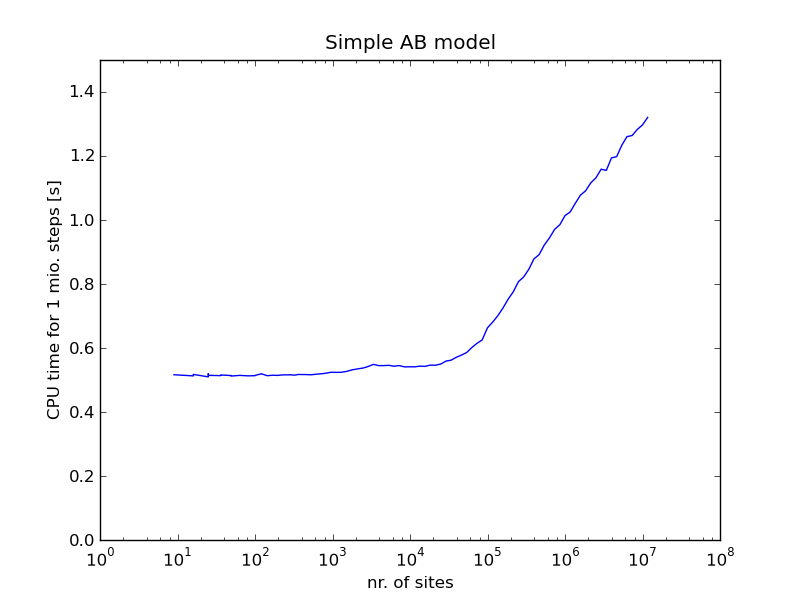

How the kmos kMC algorithm works
================================

kmos asks you to describe your model to the processor
in seemingly arcane ways. It can save model descriptions
in XML but they are basically unreadable and a pain to edit.
The API has some glitches and is probably incomplete: so why learn it?

Because it is fast (in two ways).

The code it produces is commonly faster than naive implementations
of the kMC method. Most straightforwards implementations of kMC take a time
proportional to 2*N  per kMC step,
where N is the number of sites in the system.
However the code that kmos produces is O(1) until the RAM
of your system is exceeded. As benchmarks have shown this may happen when
100,000 or more sites are required. However tests have also shown
that kmos can be faster than O(N) implementations from around
60-100 sites. If you have different experiences please let me know
but I think this gives some rule of thumb.

Why is it faster? Straightforward implementations of kMC scan the
entire system twice per kMC step. First to determine the total
rate, then to determine the next process to be executed. The
present implementation does not. kmos keeps a database of available
processes which allow to quickly pick the next process. It also
updates the database of available processes which cost additional
overhead. However this overhead is independent of the system's size
and only scales with the degree of interaction between sites, which
is seems hard to define in general terms.

The second way reason why it is fast is because you can formulate
processes in a intuitive fashion and let kmos figure how to
make fast running code out of it. So we save in human time and
CPU time, which is essentially human time as well. Yay!

To illustrate just how fast the algorithm is the graph below shows
the CPU time needed to simulate 1 million kMC steps on a simple
cubic lattice in 2 dimension with two reacting species and
without lateral interaction. As this shows the CPU time
spent per kMC step as nearly constant for up nearly 10^5 sites.

  Benchmark for a simple surface reaction model. All simulations have been
  performed on a single CPU of Intel I7-2600K with 3.40 GHz clock speed
  and 1333 MHz memory.

.. TODO:: explain algorithm underlying kmos.base

.. TODO:: describe translation algorithm
